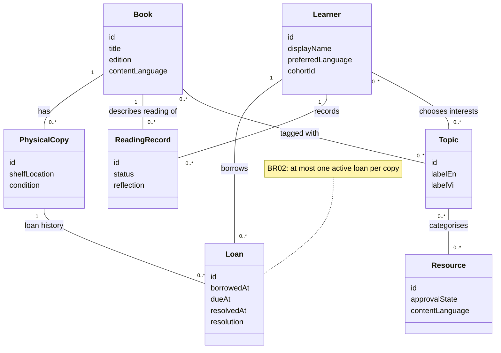
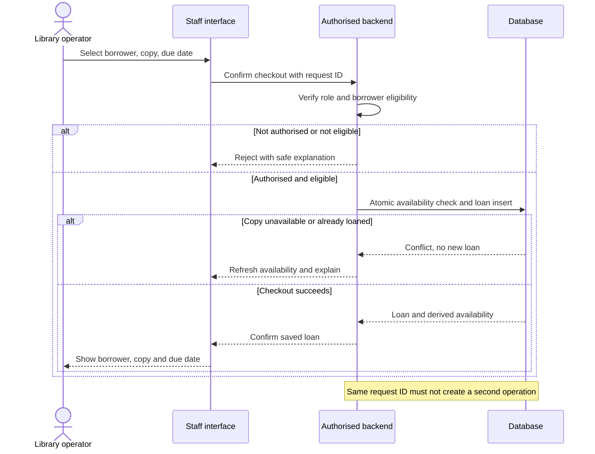
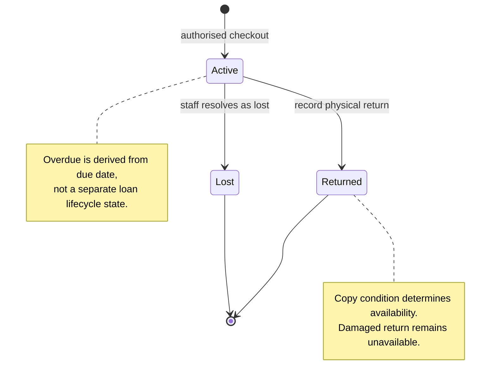
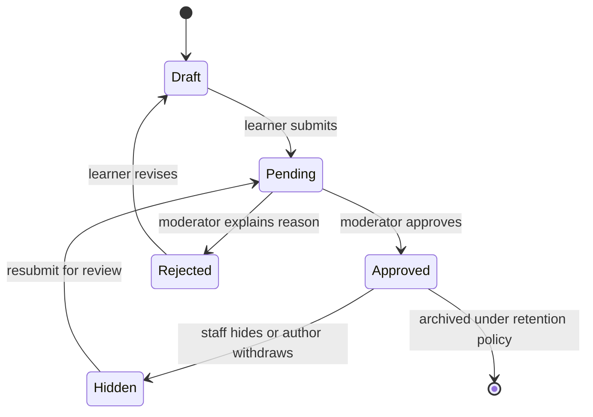

# EVG Vietnam — System Requirements and Delivery Plan

**Version:** 0.3 · **Status:** working requirements baseline · **Updated:** 10 September 2026

**Delivery policy:** frontend first, followed by the authorised Supabase accounts/catalogue pilot. Lending, reading persistence and recommendations remain later increments.

**11 September 2026 scope update:** implement real email/password registration with hosted email-link confirmation, optional magic-link sign-in, and staff-only book/copy creation. See [pilot implementation and release gates](docs/SUPABASE_PILOT.md). The initial database migration is applied; email delivery, staff bootstrap and end-to-end release checks must pass before claiming these flows are operational.

**Approval owners:** EVG programme owner and team technical lead — names to be assigned.

## Document guide

| Section | Read it to understand |
|---|---|
| 1–2 | Scope, users, system ownership, and boundaries |
| 3 | Student and staff use cases |
| 4–5 | Functional and non-functional requirements with acceptance criteria |
| 6 | Business rules and conceptual UML diagrams |
| 7–8 | Frontend scope, incremental delivery, and traceability |
| Appendices A–C | Detailed workflows, future architecture, cost and handover |
| Recommendation design | Later rules-based and AI work, preserved in full |

Use [README](README.md) for setup and the system map, and [design research](docs/DESIGN_RESEARCH.md) for reference platforms and our original design decisions. IDs are stable: **S** = system, **UC** = use case, **FR** = functional requirement, **NFR** = quality requirement, **BR** = business rule. Reference IDs in issues and pull requests.

This structure follows common software requirements specification (SRS) practice: scope, actors, observable requirements, constraints, traceability, and acceptance. It is informed by the public overview of [ISO/IEC/IEEE 29148:2018](https://www.iso.org/standard/72089.html); it does not claim formal compliance with the complete paid standard. Diagrams use Mermaid's UML class, sequence, and state notation, informed by [OMG UML 2.5.1](https://www.omg.org/spec/UML/2.5.1/About-UML). They describe proposed behaviour, not implemented infrastructure.

## 1. Purpose, scope, and constraints

Help EVG students find books, record reading, discover interests, create and share work, and receive support through a simple bilingual website. Help local staff operate a small physical library and maintain approved learning resources.

**Scope authority:** “What we currently suggest” in the EVG teaching brief, followed by the user's subsequent instructions. The removed “Software: Teaching the local students…” paragraph and the PDF's later AI feasibility discussion do not establish requirements. Formal curriculum authoring, graded courses, and a full learning management system are excluded.

The learning journey is **read → record → explore → create → receive feedback → recognise → share**. Features enter production only when their learning purpose and local operator are clear. The intended pilot remains one centre with 20–40 learners; verify this and the learners' ages before implementation.

- React and TypeScript; maintain one application and a small set of reusable components.
- English and Vietnamese; English starts a new browser session unless Vietnamese was previously selected. Interface language is independent of the language a resource teaches or contains.
- Individual email-based accounts remain the proposed production direction. Validate student email access and recovery support before backend work; the frontend preview asks for no credentials.
- Daily operation must be possible for nontechnical EVG staff. Assign a funded technical successor for maintenance and recovery.
- No production student data during frontend evaluation. Sample records reset on refresh; language preference alone persists locally.
- Recommendations begin as honest placeholders. Working rules-based suggestions are Phase 6; AI is conditional Phase 7.

**Out of scope initially:** self-service physical checkout, fines/payments, reservations, renewals, multi-centre transfers, public profiles, private messaging, automatic translations of unreviewed educational content, AI chat, competitive leaderboards, and offline write synchronisation.

## 2. Actors and system responsibilities

| Actor | Responsibility | Access boundary for production |
|---|---|---|
| A01 Learner | Browse, record own reading, set interests/goals, submit work | Own private data plus approved cohort content; never another borrower's identity |
| A02 Facilitator | Support assigned learners and give feedback | Assigned cohort and learner support records |
| A03 Library operator | Register copies, issue/return books, resolve circulation errors | Catalogue and authorised loan records; no unrelated private feedback |
| A04 Moderator | Review showcases/comments, handle reports | Assigned moderation queue and publication controls |
| A05 Administrator | Manage accounts, permissions, resources, exports | Explicit administrative permissions with recorded actions |
| A06 Programme owner / technical successor | Fund, operate, maintain and recover the service | Organisational ownership; technical access limited to duties |

One person may hold multiple staff permissions; do not assume every volunteer is an administrator. The prototype's open staff route is not an authorisation mechanism.

| System | Functions and records | Production dependencies | Accountable role |
|---|---|---|---|
| S01 Accounts | Invitations, sign-in, recovery, profiles, cohort and staff permissions | Operational foundation | Administrator |
| S02 Catalogue and inventory | Book metadata, topic tags, unique copies, shelf and condition | S01 | Library operator |
| S03 Circulation | Who borrowed which copy, due dates, returns, loss resolution, availability | S01, S02 | Library operator |
| S04 Reading and interests | Reading status, reflections, preferred topics | S01, S02 | Facilitator |
| S05 Goals | Weekly exploration plan and progress | S01, S04 | Facilitator |
| S06 Projects and feedback | Presentation summaries and private feedback | S01, S05 | Facilitator |
| S07 Recognition | Reward definitions, reviewed awards, corrections | S01, S04, S06 | Programme owner |
| S08 Showcases | Submission, moderation and cohort publication | S01, S06 | Moderator |
| S09 Comments and Q&A | Moderated comments, reports and removal | S01, S08 | Moderator |
| S10 Topics and resources | Bilingual topic IDs, approved materials, educator picks | S01 | Content educator |
| S11 Recommendations | Explainable rules; optional reviewed AI assistance later | S02, S04, S10 | Content educator + technical lead |
| S12 Operations | Queues, authorised exports, support, backup, handover | Incremental with each system | Administrator + successor |

## 3. Use cases

These are target production workflows. Section 7 identifies which parts can currently be tried with fixtures. Normal flows must have corresponding validation, empty, permission-denied, and failure states before production.

| ID / actor | Goal and precondition | Main success flow | Alternative / failure | Observable postcondition |
|---|---|---|---|---|
| UC01 / Learner | Access own learning; invited account exists | Sign in → open own home → sign out | Invalid/expired invitation or password: safe error and recovery path | Only the correct learner's records are available; sign-out clears private UI |
| UC02 / Learner | Find a book; published catalogue exists | Open Library → search/filter → open title → inspect available copies | No match: clear filters; unavailable: offer another book or staff help | Book details and derived availability shown without borrower names |
| UC03 / Library operator | Lend a copy; permission, eligible borrower and usable copy exist | Select borrower and copy → review due date → confirm once | Duplicate, ineligible, unavailable or concurrent loan: reject and explain | Exactly one active loan; availability decreases by one |
| UC04 / Library operator | Resolve a loan; active loan exists | Find copy → record return and condition → confirm | Lost/damaged copy: record correct resolution; retry safely | Loan resolved accurately; only a usable returned copy becomes available |
| UC05 / Learner | Record reading; authenticated profile exists | Choose catalogue title → add reading record → mark finished → optionally reflect | Existing record: edit rather than duplicate; interrupted save: retry | Reading history persists independently of physical loans |
| UC06 / Learner + facilitator | Explore an interest and plan a goal | Choose interests → browse approved activity → agree a weekly goal → record progress | No interests: educator picks; unsuitable activity: choose another | Editable interests and a resumable goal; no forced topic path |
| UC07 / Learner + facilitator | Receive feedback on a discovery | Save project summary → submit privately → facilitator reviews | Incomplete summary: validation; access denied: no private data | Student can revisit private feedback |
| UC08 / Facilitator | Recognise a defined learning behaviour | Check published criteria → verify evidence → award | Duplicate/ineligible award rejected; authorised correction recorded | One auditable award per qualifying milestone |
| UC09 / Learner + moderator | Share work safely | Submit selected project → moderator approves → cohort sees it | Reject with reason, revise/resubmit, or withdraw/hide | Only approved, unhidden work is visible to peers |
| UC10 / Learner + moderator | Ask a learning question | Submit comment → staff review → approve → peers can read | Report/hide abuse; disable comments when no moderator is available | Pending/rejected content stays private; reports are actionable |
| UC11 / Learner | Discover a suitable next topic; curated baseline is ready | Filter approved resources → rank by rules → show a small diverse set with reasons | Missing history: editorial fallback; no suitable match: no invented result | Explainable suggestions; student can ignore or correct interests |
| UC12 / Administrator + successor | Keep the service operable | Manage content/users → inspect queues → export authorised data → rehearse restore | Failed backup/deployment: alert owner and use documented recovery | Routine work and recovery can be completed after maker handover |

## 4. Functional requirements

**Priority:** Must = required for its stated release, Should = valuable after validation, Conditional = requires the listed evidence. A later-phase Must does not enter the current frontend scope automatically. All rows are planned production requirements; a demo is not completion.

| ID | System / use case | Requirement: the system shall… | Priority / phase | Acceptance criterion |
|---|---|---|---|---|
| FR01 | S01 / UC01 | Support invitation, sign-in, sign-out and account recovery | Must / 2A | Invited user can recover access; expired links fail safely |
| FR02 | S01 / all | Enforce learner/cohort/staff permissions server-side | Must / 2A onward | Cross-learner and unauthorised staff requests are denied in direct API tests |
| FR03 | Shared / all | Provide EN/VI controls and messages and retain selected interface language | Must / 1 onward | Language changes cover navigation, forms, errors and empty states; saved VI survives reload |
| FR04 | S02 / UC02 | Search book titles and filter by topic without mandatory typing | Must / 2B | Browse works with empty query; no matches offers recovery |
| FR05 | S02 / UC02 | Store one catalogue entry per edition/language with multiple labelled copies | Must / 2B | Two physical copies share metadata and retain distinct IDs/location/condition |
| FR06 | S03 / UC03 | Issue a specific copy to an eligible borrower with due date | Must / 2B | Competing checkout requests produce exactly one active loan |
| FR07 | S03 / UC04 | Record usable returns, damaged/lost handling and traceable corrections | Must / 2B | Return restores availability only if usable; retry does not duplicate resolution |
| FR08 | S03 / UC02–04 | Derive availability and show own loans or authorised staff loan views | Must / 2B | Counts agree with copy condition and active loans; peers' identities never appear |
| FR09 | S03 / UC04 | Identify overdue loans in the centre's configured timezone | Must / 2B | Boundary dates produce expected overdue results using agreed policy |
| FR10 | S04 / UC05 | Save, correct and revisit reading status and optional reflection | Must / 2C | Personal/in-centre reading works without a loan; return does not finish reading |
| FR11 | S04 / UC06 | Allow interests to be selected, removed and changed | Must / 2C | No selection is valid; changing interests does not erase history |
| FR12 | S05 / UC06 | Save a weekly goal and its progress with facilitator support | Should / 3 | Student resumes and updates the same goal in a new session |
| FR13 | S06 / UC07 | Save project summaries and private facilitator feedback | Should / 3 | Assigned reviewer and author can view feedback; peers cannot |
| FR14 | S07 / UC08 | Award recognition using published, reviewed criteria | Conditional / 3 | EVG approves fair criteria; duplicate awards are prevented and corrections logged |
| FR15 | S08 / UC09 | Moderate work before cohort publication and support withdrawal | Conditional / 4 | Draft/pending/rejected/hidden work is absent from peer responses |
| FR16 | S09 / UC10 | Moderate comments and provide reporting/hiding and a disable control | Conditional / 4 | Named moderator exists; pending text never reaches peers; disabled comments reject submissions |
| FR17 | S10 / UC06 | Manage bilingual topic labels, approved resources and educator picks | Must / 2C | Staff publish/withdraw content; withdrawn resources disappear from discovery |
| FR18 | S11 / UC11 | Label editorial examples and avoid simulated personalisation claims | Must / 1 onward | Current cards are identified as examples; no AI or ranking request occurs |
| FR19 | S11 / UC11 | Recommend approved, usable material through explainable rules and fallbacks | Conditional / 6 | Baseline comparison justifies work; synthetic edge cases and educator review pass |
| FR20 | S11 / UC11 | Introduce AI only for a measured limitation, with review, budget and fallback | Conditional / 7 | Document benefit versus rules; no unreviewed generated material reaches learners |
| FR21 | S12 / UC12 | Provide authorised routine content/account management and exports | Must / incremental | Staff perform operations through UI; export is permission-checked |
| FR22 | S12 / UC12 | Support documented backup, restore and ownership transfer | Must / before pilot; rehearse in 5 | Successor independently restores test data and verifies loan/permission integrity |
| FR23 | Shared / all | Make submission status and failure recovery explicit | Must / each backend increment | Failed save is never reported as saved; retry preserves entered data and avoids duplicates |

## 5. Non-functional requirements

Targets below are proposed release gates. Record measured evidence; do not mark a target achieved because the design intends it.

| ID | Quality / measurable target | Verification | Applies |
|---|---|---|---|
| NFR01 | Four primary student destinations; primary book flow takes at most three selections from home | Walkthrough: Library → title → add reading | Frontend |
| NFR02 | At least 4 of 5 representative learners complete finding/recording a book without step-by-step help after one orientation | Observed formative usability session; revise and repeat if missed | Before backend expansion |
| NFR03 | Target applicable WCAG 2.2 AA; visible keyboard focus; primary controls ≥44×44 CSS px; no colour-only status | Keyboard and screen-reader review, contrast measurement, automated audit plus manual checks | Every release |
| NFR04 | No horizontal page scrolling at 360 CSS px; usable at 200% zoom and long VI labels | Browser checks on home, library, dialog, explore, staff | Frontend onward |
| NFR05 | All owned UI strings in EN/VI; no exposed translation keys; Vietnamese reviewed by EVG | Key parity check and bilingual task walkthrough | Each increment |
| NFR06 | Initial first-party transfer target ≤500 KB compressed before optional content; target LCP ≤2.5 s on agreed pilot device/network | Record build sizes and throttled browser measurements; confirm with actual devices | Before pilot; prototype has no performance certification |
| NFR07 | No autoplay video or required remote font; saved content clearly distinguished from unsaved content | Network inspection; simulate outage during writes once backend exists | Frontend / backend respectively |
| NFR08 | No credentials, private student records or service secrets in client fixtures/logs; all production private reads/writes authorised | Repository inspection plus API permission tests | Frontend / 2A onward |
| NFR09 | One active loan per copy and idempotent retries across concurrent clients | Transaction/concurrency and retry tests against real database | 2B; cannot be proven by local demo |
| NFR10 | Proposed daily recoverable backup, RPO ≤24h and RTO ≤1 working day, subject to EVG funding approval | Restore drill including stored files and permissions | Before real pilot |
| NFR11 | No new runtime library without an explained need; cohesive feature modules, typed data and repeatable lint/build | Review, clean-install build, documented environment | Every increment |
| NFR12 | Named primary and backup for library/moderation/technical duties; Vietnamese runbook; successor deploys and restores unaided | Observed handover exercise and signed ownership checklist | Phase 5; basic owners before pilot |
| NFR13 | Monthly infrastructure ceiling approved before provisioning; AI disabled by default; usage alerts have an owner | Review actual vendor estimate, billing and usage controls | Before backend; separate AI budget in 7 |
| NFR14 | Agree retention, consent/safeguarding, account removal and export rules before collecting learner data | EVG policy review and deletion/export acceptance scenarios | 2A discovery and each data expansion |

See [WCAG 2.2](https://www.w3.org/TR/WCAG22/) for the accessibility reference. Targets are engineering and pilot criteria, not a legal-compliance determination.

## 6. Business rules and UML models

| ID | Rule |
|---|---|
| BR01 | A book entry describes an edition/language. A physical copy is one lendable item. A loan records circulation. A reading record describes learning. These are separate records. |
| BR02 | A copy has at most one active loan. Enforce this atomically in the future backend; a disabled button is insufficient. |
| BR03 | Available count = usable copies with no active loan. Never maintain an independently editable count. |
| BR04 | Checkout and return neither mark reading finished nor award recognition. In-centre and personally owned books may be logged without borrowing. |
| BR05 | Lost resolution does not mean returned. A found copy must be inspected and corrected by staff before becoming available. |
| BR06 | Learners see only their own loans; catalogue availability never reveals another borrower. |
| BR07 | Only approved, unhidden cohort submissions/comments appear to peers; moderators can disable discussion. |
| BR08 | Resource safety, language and practical usability filters run before recommendation ranking. No data means reviewed fallbacks, not invented preferences. |
| BR09 | Loan duration, limits, overdue boundaries, privacy retention and award criteria are EVG decisions to resolve before the relevant release. |
| BR10 | Keep a paper circulation fallback during outages. Staff reconcile it before resuming digital transactions; the first release does not sync offline writes. |

### 6.1 Conceptual class diagram — future domain model

This is not a database migration. Field types, indexes, retention and permissions require a later design review. The diagram deliberately covers the core library/learning relationship rather than every S01–S12 entity.



### 6.2 Sequence diagram — production checkout, deferred



### 6.3 State diagram — loan resolution, deferred



A later found-copy correction is recorded separately against the lost resolution; it does not rewrite history into a normal return.

### 6.4 State diagram — moderated showcase, deferred



## 7. Frontend increment and interface contract

### Current reviewable prototype

| Route | What can be tried now | What remains deferred |
|---|---|---|
| `/learning` | Current-book details, finished count, example goal checkbox, sample shelf | Persisted goals, actual reward logic, personalised home data |
| `/library` | Bilingual title search, topic filter, no-results recovery, book dialog, reading list/status, sample borrowed-book view | Real catalogue, metadata editing, full loan history/due dates and lost-copy handling |
| `/explore` | Three expandable activities, editable demo interests | Managed resources and working recommendations |
| `/community` | Fictional showcase layout and explanatory placeholder | Submission, private feedback, badges, comments and moderation |
| `/admin` | One reversible sample checkout/return, linked sample availability | Protected access, production circulation, catalogue/accounts/queues/exports |
| `/sign-in` | Preview entry and language switching | Authentication and recovery |

All interactions use in-memory React state. Reload resets them; no student data is saved. The staff preview is intentionally open and contains fictional records only. Neither screen completeness nor a local-state demonstration satisfies a production FR.

### Design and engineering rules

1. Keep four labelled student destinations and one obvious primary action per task; staff tools remain separate.
2. Use a shared shell, book card/dialog, spacing/colour styles and language resources. Use native labelled inputs and focus-trapping native dialogs.
3. Keep sample catalogue data in `src/demo/catalogue.ts` and state in `src/demo/`. Components consume typed values; later replace this boundary with authorised application operations.
4. Add loading, saving, success, validation and recoverable-error states when connecting each operation. Do not pretend the current synchronous fixture demonstrates those states.
5. Preserve the approved frontend through backend integration; bind real results to the same workflows and test permissions separately.
6. Present badges, submissions, comments and recommendations as future work until their individual frontend slices and local operating process are approved.

The completed prototype checks and remaining release evidence are recorded in [Frontend verification](docs/FRONTEND_VERIFICATION.md).

### Frontend work still to do before backend

- **1A — Visual foundation:** current book/library/explore/staff demonstration; bilingual desktop/mobile review.
- **1B — Remaining workflow prototypes:** editable goals, project submission/private feedback, badge criteria display, showcase/comment moderation and full library edge states, still with fictional fixtures.
- **1C — Local validation:** observe students and staff; review Vietnamese, target devices, keyboard/screen-reader behaviour; simplify based on findings. Approve a short first backend backlog.

Do not build all of 1B in one pass. Start with the physical-library task EVG operators prioritise, demonstrate it, then add the next meaningful interaction.

## 8. Delivery, traceability, and change control

### Roadmap and exit gates

| Phase | Deliverable | Exit gate |
|---|---|---|
| 0 | Confirm ages/devices/network, inventory, account access, circulation rules, owners and budget | EVG validates pilot brief and unresolved decisions |
| 1A–1C | Frontend design, incremental workflow prototypes, local usability validation | Representative users can complete core tasks; remaining states and scope recorded |
| 2A | S01 accounts + S12 operational foundation | FR01–02, NFR08 and basic recovery pass with real permissions |
| 2B | S02 catalogue/copies + S03 circulation | FR04–09 and BR01–06 pass, including concurrency/retries and paper reconciliation |
| 2C | S04 reading/interests + S10 approved resources | FR10–11, FR17 persist correctly and remain private |
| 3 | Goals, projects/private feedback; conditional recognition | FR12–14 deliver demonstrable learning value and fair criteria |
| 4 | Moderated showcases and conditional comments | FR15–16 pass and a funded moderation owner exists |
| 5 | Stabilise and transfer operations | Successor deploy/restore and EVG routine-operation exercises pass |
| 6 | Rules-based discovery | FR19 beats or meaningfully improves the educator baseline for a measured need |
| 7 | Optional AI assistance | FR20 demonstrates added value within a separate budget and reviewed fallback |

**Immediate action order:** review this prototype with the team → confirm student devices and Vietnamese terminology → choose the next missing frontend workflow → test with EVG → approve the minimum backend slice. The makers' previous 10–16 week estimate predates expanded circulation and frontend validation; re-estimate after Phase 0 using actual team capacity.

### Traceability and evidence matrix

| Evidence ID | Requirements | Evidence required |
|---|---|---|
| V01 | FR03–04, NFR01/04/05 | EN/VI home → library → details; filter/no-results; mobile reflow; language reload |
| V02 | FR10–11/18 | Demo reading transitions across routes, interest toggles, honest recommendation labels; repeat against persistence in 2C |
| V03 | FR06–09, BR01–06, NFR09 | Demo return affects availability but not reading; later real concurrent checkout, due-date, loss and retry tests |
| V04 | FR01–02/23, NFR08 | Real invite/recovery/sign-out plus denied direct API access, failed-save and shared-device tests |
| V05 | FR12–16 | Goal/project/reward/moderation use-case tests with approval and rejection paths |
| V06 | FR17/19–20 | Published-resource filtering, cold-start fallback and comparison with educator baseline |
| V07 | FR21–22, NFR10–14 | Ownership/runbook, cost review, privacy decisions, export and restore drill |
| V08 | NFR02–07/11 | Student observation, accessibility review, device/network measurements, lint and build |

**Issue template:** `Sxx / FRxx: observable outcome`; include owner, reviewer, phase, dependencies, UI states, acceptance examples, verification evidence and documentation impact. Statuses: Backlog → Ready → In progress → In review → Verified. “Prototype verified” and “Production verified” must be distinct labels.

**Change control:** record proposed scope changes with rationale, affected IDs, workload/cost/moderation impact and approving owner. Preserve IDs when wording changes; deprecate IDs rather than reuse them. A passed frontend demonstration does not authorise adding AI, collecting real data, or releasing unreviewed social features.

## Appendix A. Detailed feature guidance

The following elaborates the requirements above. Proposed production behaviours remain deferred unless Section 7 explicitly identifies a demo interaction.


### Library catalogue, copies, and borrowing — S02/S03

This is now part of the first working release following the explicit request to track who borrowed what and what is available.

**Keep four records distinct:**

| Record | Meaning | Example |
|---|---|---|
| Book entry | Shared bibliographic details for an edition/language | One catalogue entry for a particular Vietnamese book |
| Physical copy | An individual item owned by the centre | Copy EVG-001 and copy EVG-002 reference that entry |
| Loan | Who holds one physical copy and when it is due/returned | Learner A borrows EVG-001; EVG-002 remains on the shelf |
| Reading record | What a learner is reading or has finished | Learner B reads the book at the centre without borrowing |

**S02 catalogue and inventory tasks:**

- Staff add/edit book title, author where known, language, description, and reviewed topic tags.
- Register each physical copy with a unique human-readable copy ID, shelf location, and condition: usable, damaged, lost, or withdrawn.
- Provide title/author search and basic language/topic filters. An unavailable title may remain discoverable with its actual availability shown.
- Archive or withdraw records instead of deleting records required by existing loan history.
- Use manual entry and simple copy labels first. Bulk imports, barcode scanners, and external ISBN lookups are later enhancements.

**S03 borrowing tasks:**

- An authorised library operator selects the borrower and exact copy, confirms the due date, and records checkout.
- Checkout requires an active eligible borrower, a usable copy, and no active loan for that copy. Enforce one active loan per copy atomically, including simultaneous checkout attempts.
- Staff view current loans, borrower, copy, checkout date, due date, and overdue status. Learners view only their own loan details.
- Return closes the active loan and preserves its history. A usable returned copy becomes available; a damaged copy stays unavailable until staff resolve its condition.
- Lost-copy resolution preserves borrower/history and closes the loan with a lost outcome, never a false return. Finding a lost copy requires staff to inspect and update its condition before it becomes available.
- Correct mistakes through an authorised, recorded correction. Repeating checkout/return requests must not create duplicate loans or reopen a closed loan.

**Availability is calculated:** a copy is available only when usable and without an active loan. A book's available count is the number of its available copies. Do not maintain a second manually edited availability count. Overdue means an unresolved active loan has passed its due date in the centre's local timezone; it does not make a copy available.

Checkout and return require confirmed connectivity in the first release. Display a clear unsaved state on failure; during outages staff use a paper log and reconcile it before normal digital lending resumes.

**Pilot policy:** staff-controlled checkout and return; due dates recorded on every loan. EVG must agree the standard loan period, eligibility/loan limits, centre timezone, and lost/damaged-book procedure in Phase 0. First release excludes reservations, automatic fines/payments, automated reminder messages, renewals, inter-library transfers, and unattended self-checkout. These are later enhancements rather than prerequisites for basic lending.

Borrowing or returning a book does not automatically mark it as read, establish an interest, or award a badge. Students may add a loaned book to their reading list with an explicit action. A student may record a personally owned or in-centre book without creating a loan or fictitious inventory copy.

### A. Reading history and interests — S04

Students should be able to:

- Select a book from a small staff-maintained catalogue.
- Mark it as currently reading or finished.
- See their own reading history.
- Select topics they enjoy.
- Add an optional short reflection or interest rating.
- Ask a facilitator to add a missing book.

Facilitators should be able to:

- Add and correct book records.
- Help students update reading records.
- View their assigned learners’ interests and reading histories.
- Verify reading milestones when needed for rewards.

Reuse S02's book catalogue and topic identifiers. Start with title, author where known, language, and manually assigned topic tags. The basic lending workflow is specified above; advanced library automation and automated book analysis remain deferred.

Reading histories remain private to the learner and authorised staff. Students choose what they share through a separate showcase.

### B. Weekly exploration and volunteer-supported goals — S05

Provide a simple weekly learning record:

- What do I want to explore?
- What will I read, try, or make?
- What help do I need?
- What did I discover?
- What would I like to explore next?

Students and volunteers can use this to agree on a small learning goal. It should support student interests without requiring formal timetables, graded courses, or curriculum administration.

A goal may reference a physical book, an approved resource, a practical activity, or a small project.

Students can prepare a presentation or demonstrate their work in person. The website stores a short title, summary, and progress status; recording or uploading a video is not required.

### C. Projects, presentations, feedback, and interest ratings — S06

Facilitators can leave brief private feedback using a consistent structure:

- Something the student did well.
- A question or suggestion.
- A possible next step.

Students can indicate whether a topic was interesting and whether they want to explore it further.

Distinguish:

- A student reporting that they finished.
- A facilitator reviewing a presentation or demonstration.
- Approval to publish something to peers.

These are separate actions and should not be treated as interchangeable proof of learning.

### D. Badges and rewards — S07

Include rewards as a planned early capability.

Start with a small, understandable set recognising:

- Completing a reviewed reading milestone.
- Exploring a new topic.
- Sharing a presentation or project.
- Helping another student, confirmed by a facilitator.

Use private personal progress and visible explanations of how recognition is earned. Avoid a public leaderboard in the initial version.

Implementation requirements:

- Define each reward’s criteria.
- Record the event or staff decision that justified it.
- Prevent duplicate awards from repeated submissions.
- Allow an administrator to correct an accidental award.
- Preserve legitimate achievements when unrelated records are edited.

Physical pins or other rewards can accompany digital badges if EVG wants them. Their purchase and distribution are programme responsibilities with a separate budget.

### E. Peer showcases — S08

Create a closed showcase for the pilot cohort where students can share discoveries and see what classmates are learning.

The first version supports:

- A project or presentation title.
- A short summary.
- Related books or topics.
- An optional staff-approved resource or image.
- An invitation to ask questions.

Publication workflow:

**Student draft → submit for review → facilitator approves → visible to the cohort.**

Sharing is optional. Full reading histories, emails, and private feedback never become visible automatically.

Students should be able to request withdrawal of their work. Authorised staff can immediately hide a published item.

### F. Comments and questions — S09

Implement **moderated comments and Q&A attached to showcases** as the initial peer communication feature.

This supports asking for help and offering encouragement while keeping discussions connected to learning.

Initial behaviour:

- Comments use plain text.
- Student comments require approval before other learners see them.
- Facilitators can approve, reject, hide, or respond.
- Students can report inappropriate content.
- Staff can temporarily disable comments if moderation coverage is unavailable.
- Direct private messaging is outside the first version.

Comments are an intended feature, not an indefinite “maybe.” Activating them requires a named moderator and backup.

### G. Topic and AI recommendation previews — S11

Include recommendation areas in the prototype so the intended future experience is visible.

During early releases:

- Use a small set of educator-selected examples.
- Label them “Educator picks,” “Example suggestions,” or “Coming later,” as appropriate.
- Do not describe examples as personalised or AI-generated unless that is actually true.
- Avoid fabricated explanations such as “Recommended because you read…” when no matching logic exists.
- Keep previews optional to the main reading and sharing workflow.
- Make no AI API calls.

Working recommendations are implemented only in the final phases.

### H. Learning resources and topics — S10

Give authorised staff simple forms to create topic labels in both languages, tag books/resources consistently, add approved resource links or activity descriptions, record language/difficulty/access needs, and publish or withdraw resources. Record source and review date. Keep drafts unavailable to learners.

Students browse educator picks and approved resources even before recommendations work. The catalogue is usable independently of S11. Use a single shared topic list rather than separate, incompatible labels for books and resources. Resource metadata and later topic relationships are detailed in the Recommendation design appendix.

### Student navigation and bilingual design

Use four primary student destinations:

| Destination | Contents |
|---|---|
| My learning | Current reading, weekly goals, and recognition |
| Library | Catalogue/availability, own loans/due dates, and reading list |
| Explore | Interests, approved activities/resources, and recommendation previews |
| Together | Approved showcases and moderated questions |

Provide a prominent next action, such as “Add a book” or “Continue my goal,” rather than showing every feature with equal emphasis.

Design requirements:

- English initially, with a visible Vietnamese switch and preservation of the saved language preference, matching the current frontend. Assess learning-resource language separately.
- Preserve the current screen and unsaved work when switching language.
- Translate navigation, instructions, errors, emails, moderation notices, and staff guidance.
- Use icons with text labels.
- Support keyboard navigation, readable contrast, zoom, and large touch controls.
- Avoid mandatory long written reflections.
- Test younger and older learners separately.
- Keep videos optional, with an alternative where they are essential to understanding.

Physical reading spaces and optional dance activities remain part of EVG’s programme environment. The website can support them through approved resources, but furnishing a lounge or implementing a dance-game system is outside website development.


## Appendix B. Future architecture and data guidance

This is a proposed backend direction for Phase 2 onward; no database work is part of the current frontend increment.


### Architecture

Retain the proposed small managed architecture:

| Component | Choice |
|---|---|
| Frontend | React, TypeScript, Vite |
| Hosting | Cloudflare Pages |
| Database, authentication, storage | Managed Supabase |
| Privileged account operations | Server-side functions |
| Authentication email | Production SMTP provider |
| Staff tools | Bilingual administration screens within the same website |
| Source and deployments | One EVG-controlled repository |

Build reusable interface components and keep the application in one repository. Avoid microservices and a separate content-management platform for this scale.

The staff interface must support routine work without editing source code or using the database console.

### Data and application interfaces

Replace the previous lesson-centric model with these concepts:

| Concept | Purpose |
|---|---|
| Learner and cohort | Identity, access, language, and facilitator assignment |
| Book | Staff-maintained catalogue entry |
| Physical copy | Book reference, unique copy ID, location, and condition |
| Loan | Borrower, physical copy, checkout/due dates, and return or resolution history |
| Reading record | Learner, book, status, dates, and optional reflection |
| Interest | Learner-selected topic |
| Learning goal | Weekly exploration plan and progress |
| Project or presentation | Student’s summary and facilitator review |
| Reward award | Recognition linked to qualifying evidence |
| Showcase | Approved cohort-visible presentation of work |
| Comment or question | Moderated discussion attached to a showcase |
| Resource | Educator-approved supporting material |
| Administrative record | Necessary access changes and moderation decisions |

Application interfaces should cover:

- Managing a learner’s own reading records, interests, and goals.
- Reviewing assigned learners.
- Awarding and correcting rewards.
- Submitting and moderating showcases and comments.
- Managing books and approved resources.
- Registering copies, computing availability, and issuing/returning loans through authorised atomic operations.
- Exporting authorised records.

Recommendation previews use clearly identified editorial content. Personalisation services and AI interfaces are added in later phases.

### Access rules

- Learners can access their own private records.
- Learners can view book availability and their own loans, but not other borrowers' identities.
- Authorised library operators manage inventory/loans with access to the minimum required borrower information; private educator feedback needs separate permission.
- Educators can access assigned learners and authorised moderation functions.
- Cohort members can see approved showcases and approved comments.
- Administrators manage staff access and organisational settings.
- Learners cannot award themselves verified rewards or approve their own submissions.
- Privileged credentials remain server-side.
- Database and storage permissions enforce access independently of the interface.

Use separate test and production environments. Test data must be synthetic; preview deployments must not write to production records.

### Email and shared devices

Use staff-invited email/password accounts with bilingual recovery guidance.

Confirm that every intended learner has appropriate access to a distinct email address. A single guardian email cannot identify several independent learners under the initial account model. Resolve shared-inbox cases before enrolling affected students.

On shared devices, provide clear sign-out, avoid persistent sign-in by default, and clear the previous learner’s displayed and cached data.

### Connectivity

The first working release requires internet for authentication and saving records.

It should:

- Load mainly text and compressed images.
- Show when something has not saved.
- Support retries without duplicate loans, reading records, comments, or rewards.
- Avoid autoplay and large student media uploads.
- Allow printable weekly-goal or reflection sheets for interrupted sessions.

Full offline synchronisation remains a separate capability. If field testing finds that internet availability prevents the core workflow, reassess delivery before extending the platform.

### Children’s records and moderation

Before live enrolment, EVG must establish the applicable consent, privacy, retention, and safeguarding arrangements, including review of external service providers and international data processing.

Collect only necessary information. Keep email addresses and personal records out of peer-facing screens, and avoid identifying student information in routine technical logs.

Use staff-approved resources and record their sources. Provide quick withdrawal controls for unsuitable material.

### Backups and technical continuity

Maintain database backups and separate file backups. Supabase database backups do not include the actual objects stored through its Storage API. [Supabase backup documentation](https://supabase.com/docs/guides/platform/backups)

Recovery testing must verify accounts, permissions, book entries, physical copies, active/history loans, reading history, rewards, showcases, moderation state, and files—not merely that a CSV can be downloaded. Derived availability must agree with restored copy conditions and active loans.

A technical successor remains necessary after the makers leave. Managed hosting does not maintain the application’s code or permission rules.


## Appendix C. Cost, ownership and production release criteria


### Budget

Retain **US$35–50/month before tax** as an initial infrastructure planning allowance for the small pilot, excluding AI, equipment, internet, staff time, and technical support.

The prior estimate assumed a US$25/month baseline database plan. Treat that as an unverified historical assumption, not a current quote. Recheck vendor pricing, extra environments, storage and usage before procurement. [Supabase pricing](https://supabase.com/pricing)

The recommendation prototype has no AI usage cost. Working AI receives a separate budget in Phase 7.

The expanded feature scope primarily increases:

- Development and testing effort.
- Physical inventory entry, copy labels, and staff time for checkout/returns and reconciliation.
- Moderation time.
- Staff support.
- Content and resource review.

Text-first showcases keep early storage costs small. Reassess costs before adding substantial image or video uploads.

### Ownership and handover

Assign named owners for:

- Programme priorities and funding.
- Book and resource management.
- Physical inventory, circulation policy, checkout/returns, and overdue/lost-copy follow-up.
- Rewards and learner support.
- Showcase and comment moderation.
- Technical maintenance and recovery.

EVG should control the domain, vendor accounts, repository, billing, and recovery methods. At least two authorised people should have organisational recovery access.

The handover package must include:

- Vietnamese operating instructions.
- Technical setup and deployment instructions.
- Account-recovery and moderation procedures.
- Catalogue, checkout, return, lost-copy resolution, and outage-reconciliation instructions.
- Backup and restore instructions.
- Known limitations.
- Recurring costs and renewal dates.
- Support contacts and responsibilities.

### Required tests

| Area | Acceptance scenarios |
|---|---|
| Catalogue and copies | Multiple physical copies share one book entry; IDs are unique; withdrawn copies retain necessary history |
| Circulation | Exact-copy checkout/return; due-date/overdue accuracy; damaged/lost resolution; corrected entries remain traceable |
| Loan integrity | Simultaneous checkout attempts cannot create two active loans; retries do not duplicate operations |
| Availability | Counts reflect usable copies without active loans, including after return, correction, and restore |
| Library privacy | Learners see their own loans; availability never exposes other borrowers; operator access excludes unrelated private feedback |
| Reading records | Add, update, correct, and revisit history; repeated retries do not create duplicates |
| Reading versus borrowing | Checkout/return does not mark a book finished or award a badge; non-loaned books can be logged as reading |
| Interests and goals | Changes persist correctly and remain private |
| Rewards | Correct eligibility, no duplicate awards, authorised correction |
| Showcases | Drafts stay private; only approved items reach the cohort; withdrawal works |
| Comments | Approval, rejection, reporting, hiding, and disabled-comment states |
| Permissions | No cross-learner private access or student-to-staff privilege escalation |
| Shared devices | Sign-out, Back, refresh, and next login reveal no previous learner’s information |
| Languages | Student and staff flows, errors, emails, and moderation messages work in both languages |
| Connectivity | Interrupted saves remain visible and retry safely |
| Recommendation previews | Clearly labelled, no fabricated personalisation, no AI requests |
| Recovery | Accounts, records, rewards, moderation states, and files restore successfully |
| Handover | EVG staff run routine workflows; the technical successor deploys and restores independently |

The previous **10–16 week** estimate predated physical-copy circulation. Re-estimate after Phase 0 establishes inventory size and team capacity; the added S02/S03 work includes lending integrity and local operating procedures. Deliver Phase 2 in the increments above rather than promising all systems together. Topic recommendations and AI follow the working core as separately reviewed increments.

After frontend validation, the first backend milestones are **2A: accounts → 2B: catalogue, copies, borrowing/returns → 2C: reading history, interests, approved resources**, accompanied by a prototype showing how rewards, showcases, discussion, and future recommendations will fit.

### Common definition of done

- The stated user workflow works with persistent data and appropriate permissions, not only fixtures.
- English and Vietnamese interface states, empty/error states, and shared-device behaviour are checked.
- The system's acceptance scenarios above pass, including relevant cross-system effects.
- Staff can correct routine mistakes through authorised operations without direct database edits.
- Migrations, recovery impact, operating instructions, and ownership are documented.
- The reviewer records verification evidence in the issue; the owner updates its status to Verified.


## Recommendation design

<a id="6-topic-discovery-with-little-initial-data"></a>

### Topic discovery with little initial data

### Starting approach

Use educator-curated topic relationships and content-based matching. The first recommender uses what a student explicitly wants to explore and what is known about approved content. It does not depend on learning patterns across many students.

This section is a proposed technical design, not an implemented feature. Keep visible recommendations editorial or explicitly labelled as examples until Phase 6. Prepare the catalogue and consistent topic identifiers during the earlier book/resource work; implement AI only in Phase 7.

The current amount of book metadata, approved resources, and learner history must be confirmed with EVG. Until then, assume no reusable behavioural dataset. Catalogue quantities below are starting targets for a pilot, not established inventory or statistical requirements.

### Separate the missing data problems

| Missing information | Initial response |
|---|---|
| Student interaction history | Ask students to select a few interests or a topic for this session; support skipping onboarding |
| Book metadata | Staff supply a short accurate description and approved topic tags; avoid inferring contents from a title alone |
| Learning resources | Build a small reviewed catalogue; a plausible topic is not useful without something suitable to read, watch, or do |
| Evidence of reading level | Offer introductory resources and ask for feedback; age, interface language, and book completion are not reliable mastery measures |
| Recommendation relevance labels | Educators review example scenarios, followed by a small real pilot |

### Build a small topic and resource catalogue

Start with approximately 15–20 specific, child-understandable topics and 30–60 approved resources, narrowing the topic range if review capacity is limited. Aim for more than one suitable resource per topic where possible. Prioritise Vietnamese content or usable Vietnamese support according to learner needs.

Use stable language-independent topic IDs, with English and Vietnamese labels. Books, resources, learner interests, and learning goals reference the same IDs. Keep content language separate from interface language; choosing English navigation does not establish English reading proficiency.

Store the following information:

| Record | Minimum useful information |
|---|---|
| Topic | Stable ID, bilingual label, short description, approved related topics |
| Book | Existing catalogue identity, accurate description, reviewed topic IDs |
| Resource | ID, topic IDs, language/support language, format, estimated duration, introductory/intermediate level, source/link, access requirements, review status/date |
| Topic relationship | Source topic, destination topic, relationship such as related exploration or deeper exploration, bilingual explanation |
| Learner preference | Explicit interest IDs, session topic where provided, preferred content language and format |

Relationship examples: birds → flight → paper aeroplanes; volcanoes → rocks → soil and growing plants. These are educator-approved exploration links, not automatically validated prerequisite sequences.

Represent relationships as ordinary records or lists. A graph database is unnecessary for this pilot. Require an approved usable resource before recommending a topic as an actionable next step.

### Recommendation pipeline

1. Read the authenticated learner's explicit preferences and current exploration request. Use recent positively received topics as a secondary signal when available.
2. Filter resources for publication approval, known suitability, content language, accessibility, and actual delivery conditions. A high relevance score cannot override these requirements.
3. Generate candidate topics from explicit interests, reviewed book tags, and approved related-topic links. Include a small educator-curated exploration pool.
4. Rank eligible topics using simple transparent rules.
5. Select a small varied set of topics, each with an appropriate resource and an explanation grounded in the rule that selected it.
6. Record which cards were actually displayed and any explicit feedback, subject to the approved data policy.

An illustrative initial score is:

```text
score = 4 × current_topic_match
      + 3 × explicit_interest_match
      + 2 × recent_positive_topic_match
      + 1 × approved_related_topic_match
      - 2 × recently_shown
```

Each feature is bounded between 0 and 1. These weights are provisional engineering defaults, not learned or validated educational measures. Cap contributions rather than rewarding content merely for having many tags. A logged book supplies topic context; it does not by itself prove enjoyment or mastery. Explicit recent choices should override stale inferred preferences.

For an initial three-card layout, aim for one close match, one related discovery, and one broader educator-approved exploration. Apply the same suitability filters to all three. Honour an explicit request to stay on a topic. Show fewer cards when there are not enough eligible choices; do not fill empty slots with unreviewed material.

Use short truthful reasons such as "You chose animals" or "Explore flight after birds." A broader discovery should be labelled as an educator pick or something new to try. Do not imply that an unfamiliar topic is already a known personal interest.

### New learners, unknown books, and sparse coverage

- A learner who skips interest selection receives a varied educator-selected set, labelled accordingly.
- A learner with interests but no reading history receives content matches to those interests.
- An untagged book does not trigger invented topic extraction. Use declared interests and flag the book for staff review.
- A topic with no suitable resource can be recorded as a request for future content; it is not presented as a complete learning recommendation.
- If no eligible resource remains, explain the limitation and provide a way to ask a facilitator. Never silently relax approval or language requirements.
- A missing click is not a negative preference; it may reflect time, device sharing, language, or connectivity.
- Separate "not interested," "too difficult," and "resource did not work" feedback. They require different responses.
- Learners can change their interests and start a different exploration without being locked into their reading history.

### Implementation boundary

Place recommendation selection in the existing Explore feature as a small testable TypeScript module. Its conceptual interface is:

```ts
recommendTopics(context, approvedCatalogue, recentFeedback, policy)
  // returns topicId, resourceIds, reasonCode, reasonData, strategyVersion
```

Keep ranking independent of React so it can be tested with fixtures. Initially, fixtures demonstrate editorial examples only. The live service obtains the learner identity from authentication and fetches only authorised records; it must not trust a client-supplied learner ID to access private history.

Localise reason codes in the interface. Resolve resources from the approved catalogue rather than accepting generated URLs. Recheck withdrawal status when serving results so cached recommendations cannot continue exposing removed resources.

The first implementation needs no model training, vector database, or model call per recommendation. Staff should manage tags, related topics, resource approval, and educator picks through normal administration screens. Keep scoring policy versioned with the code and record its version with recommendation batches.

### What data to collect gradually

Collect only signals useful to the learning experience and approved under the learner-data policy:

- Explicit interests and content-language preferences.
- A recommendation batch identifier, actual displayed topic/resource IDs, and strategy version.
- A selected or saved topic.
- Explicit interest, difficulty, or broken-resource feedback.
- Existing facilitator review of a related project, where relevant.

Do not infer learning from dwell time, count refreshes as repeated interest, or use rewards as the recommendation objective. Retention and staff access apply to recommendation events as well as other learner records.

### Evaluate before adding complexity

Compare the rules-based system with a rotating educator-selected baseline. Prepare approximately 20–30 fictional test scenarios covering new learners, multiple interests, unknown books, insufficient language coverage, changed interests, duplicates, withdrawn resources, and empty results. Fictional cases test behaviour; they do not establish real learning impact.

Ask EVG educators to judge topic relevance, resource usability, explanation accuracy, and the balance between familiarity and discovery. Then observe the 20–40 learner pilot using lightweight feedback and existing project/presentation review. Report counts and individual failure cases alongside percentages; do not claim statistical superiority from a small pilot.

Acceptance requires no unapproved resources, truthful recommendation explanations, working language/access filters, no duplicate cards, safe empty states, and useful recommendations in the reviewed scenarios. Assess learning through what students can explain or demonstrate, alongside the workload imposed on staff.

### Introduce AI where it reduces real work

First use AI offline in the content workflow: draft topic tags and related-topic suggestions from accurate, authorised book/resource descriptions. An educator reviews these before publication. Cache approved outputs and regenerate only when relevant source content changes.

If inconsistent vocabulary or cross-language matching later becomes a measured problem, evaluate pretrained multilingual embeddings for matching descriptions to the existing topic catalogue. Embeddings represent semantic similarity; they do not establish suitability, factual quality, reading level, or prerequisites. Benchmark English/Vietnamese examples before adoption. Avoid training an embedding model or adding a vector service merely because the project includes recommendations.

If a later model ranks candidates, constrain it to approved IDs, validate all returned IDs and eligibility, and fall back to deterministic matching on errors. Keep identifiable learner data out of content-enrichment requests. Set a separate budget, usage controls, and an owner for reviewing outputs.

Collaborative filtering and behavioural prediction remain outside the initial approach. Reconsider them only if interaction coverage and a held-out evaluation demonstrate a useful improvement over the simpler baseline; learner count alone is not an upgrade threshold.

### Reference basis

- [Google: Content-based filtering](https://developers.google.com/machine-learning/recommendation/content-based/basics) describes matching content features to explicit preferences without requiring other users' history.
- [Google: Content-based filtering trade-offs](https://developers.google.com/machine-learning/recommendation/content-based/summary) explains the dependence on good metadata and the limitation of recommending only within existing interests.
- [Google: Collaborative filtering trade-offs](https://developers.google.com/machine-learning/recommendation/collaborative/summary) documents cold-start limitations.

The catalogue sizes, selection rules, weights, and evaluation counts in this section are proposed project defaults, not claims taken from these sources.
