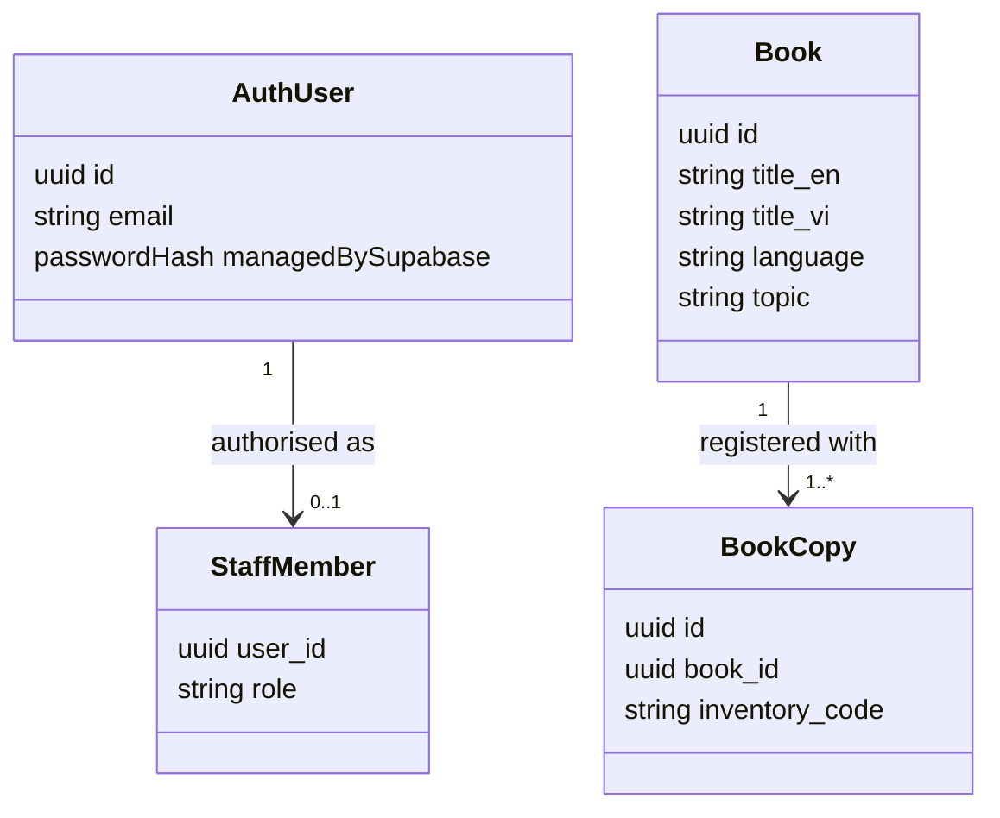

# Supabase pilot: accounts and library

## Scope and current boundary

Project: `HealEduTech` (`znftduqfbwfrprhawgxh`), organisation `EVG HealEduTech`, Seoul region, Free plan selected by the owner.

This increment implements registration with a display name, email, password and password confirmation; email verification through the hosted confirmation link; password sign-in; optional passwordless sign-in through a hosted magic link; local sign-out; a public database-backed catalogue; and staff-only creation of books and physical copies. Passwordless sign-in is an alternative to a password, **not password-plus-MFA**.

The initial SQL migration has been applied. All three application tables have RLS enabled. Supabase Auth owns email addresses and hashed passwords; no password column exists in application tables. Display name and interface preference are non-authorisation Auth metadata. Staff membership is a separate protected table and cannot be set through registration metadata.

Visitors can browse without logging in. The local September increment adds password recovery, private reading history/interests and gated circulation; apply its migrations before enabling those screens against a hosted project. Goals, activities/showcases, staff account-management, facilitator access, moderation and recommendations remain deferred or explicitly labelled examples.

## Routes and responsibilities

| Route | Behaviour | Access |
|---|---|---|
| `/sign-in` | Register, confirm by email link, password or magic-link sign-in, sign out | Public entry; Supabase validates credentials and links |
| `/library` | Read real book records and registered copy counts, paginated | Public read-only |
| `/admin` | Save a bilingual book and 1–100 physical copies in one database transaction | Authenticated account listed in `staff_members` |

An empty live catalogue stays empty; it does not fall back to fictional books after a failed request. Without public Supabase configuration, the original library/staff demo is available and account submission is disabled.

## Required hosted Auth configuration

Local `supabase/config.toml` is a reproducible development configuration. Editing it **does not update hosted project settings automatically**.

Before declaring signup and email-link sign-in ready, the technical owner must verify these hosted settings:

1. Authentication → Sign In / Providers: email sign-in and signup enabled; email confirmation **on**; anonymous sign-ins off. Set the minimum password length to 12 and retain server-side rate limits.
2. Keep the hosted default confirmation and magic-link templates. The free default mailer uses link templates and the current project cannot select custom template bodies until custom SMTP is configured; the files in `supabase/templates/` are local reference material only.
3. Authentication → URL Configuration: set the Site URL to `https://heal-edu-tech.vercel.app` and allow `https://heal-edu-tech.vercel.app/sign-in` for the explicit callback used by the app. Add `http://localhost:5173/sign-in` for local testing and only the intended preview `/sign-in` URLs.
4. The default Supabase mailer only sends to addresses belonging to organisation team members and has restrictive rate limits. Do not invite students or turn off confirmation to work around delivery failures. Configure custom SMTP and a verified sender domain in a later approved step.
5. Test receipt, valid confirmation, expired or already-used links, resend rate limits, password sign-in, magic-link sign-in and sign-out using an authorised test email. Email delivery is not verified until a real test recipient confirms it.

Do not send SMTP passwords or service-role keys through the frontend. The frontend uses only `VITE_SUPABASE_URL` and `VITE_SUPABASE_PUBLISHABLE_KEY` (legacy anon-key fallback remains for compatibility). Sessions use tab-scoped `sessionStorage`; refresh keeps the session, and users should explicitly sign out on shared devices.

## First staff account

Register and verify the nominated owner's email in the app. A trusted database operator then grants the role using the SQL Editor, substituting the explicitly approved email:

```sql
insert into public.staff_members(user_id, role)
select id, 'administrator' from auth.users
where email = 'APPROVED_OWNER_EMAIL' and email_confirmed_at is not null
on conflict (user_id) do nothing;
```

Confirm exactly one account was selected before granting access. The user can refresh the app to load the role. Never automatically make the first public signup an administrator. Organisation ownership and application staff access are separate permissions.

## Data model



The registration operation normally creates 1–100 copies per book. `add_book_with_copies` runs with invoker permissions, not elevated permissions, so its writes still obey RLS. A request-stable book UUID prevents sequential retries from creating duplicate records. Concurrent retries may report a uniqueness error; retry with the same ID to recover. Inventory counts remain separate from available copies. The circulation migration adds a public aggregate of usable copies without active loans; it exposes no borrower identity.

## Verification and release gates

- `node --test tests/auth-validation.test.ts`: email format checks, password bounds, link callback errors and safe error mapping.
- `npm run build` and `npm run lint`: compile and static checks.
- `supabase/tests/access.sql`: rollback-only database integration assertions for a trusted SQL session. The connector's `execute_sql` currently uses a read-only role and cannot run this test; a passing advisor report does not replace it.
- Public API checks verified catalogue reads work and guests cannot read staff records, insert books, or invoke the staff creation function.
- Supabase security advisor returned no findings after the initial migration.
- Local September checks passed for the prepared migrations and UI: lint/build, TypeScript unit tests, rollback-only reading/circulation SQL tests, circulation concurrency tests, and mocked browser checks for auth recovery, reading/interests, staff circulation and 360 px responsive layouts.
- Still required on the hosted project: real email receipt/verification, successful staff book creation from the browser, hosted refresh/cross-account checks, learner-denied writes against deployed policies, and responsive browser verification of the published build.

## Handover

Keep the migration, templates and this guide in Git. Record the EVG organisation owners, billing contact, email-provider owner and technical maintainer outside public source. Back up the database and test restoration before collecting real student data. No Storage buckets or ebook uploads are part of this increment.

## September increment: deployment checklist

Prepared migrations (not applied to the hosted project by this task):

1. `20260915044351_circulation.sql`
2. `20260915044352_reading_and_interests.sql`

Apply both through the usual reviewed migration process before deploying the new frontend. Keep circulation disabled until EVG approves lending rules. Registration of an eligible borrower uses an existing verified account's identifier; do not invent accounts or infer eligibility from sign-up metadata. Staff must reconcile any paper loans before enabling digital checkout. The initial policy values are placeholders, not EVG-approved rules.

Reading rows and interests are learner-owned with database access policies. Existing catalogue books can be recorded without a loan. No staff-wide reading access is granted. Loan resolution never changes reading status. Staff permissions come from `staff_members`, not user-editable metadata.

Password recovery returns to `/sign-in?mode=recovery`; verify that this exact redirect is permitted in the hosted Auth URL configuration (and for each intended preview origin). Test a new recovery email after changing redirect configuration. A successful simulated browser check is not evidence of real email delivery. Do not disable confirmation to make a test pass.

### Verification scope

Local checks use a disposable PostgreSQL database with synthetic `auth.users` and `auth.uid()` plus Supabase-style roles. They verify PostgreSQL constraints/RLS/RPC behavior, not hosted Supabase Auth, SMTP, PostgREST deployment or production data. Browser flow checks use simulated API responses, separately from SQL tests. Hosted end-to-end checks remain a release gate.

Auth UX references: [web.dev sign-in form guidance](https://web.dev/articles/sign-in-form-best-practices) and [Supabase password authentication](https://supabase.com/docs/guides/auth/passwords). The existing Supabase stack is retained; no Clerk or Eve runtime was added.
