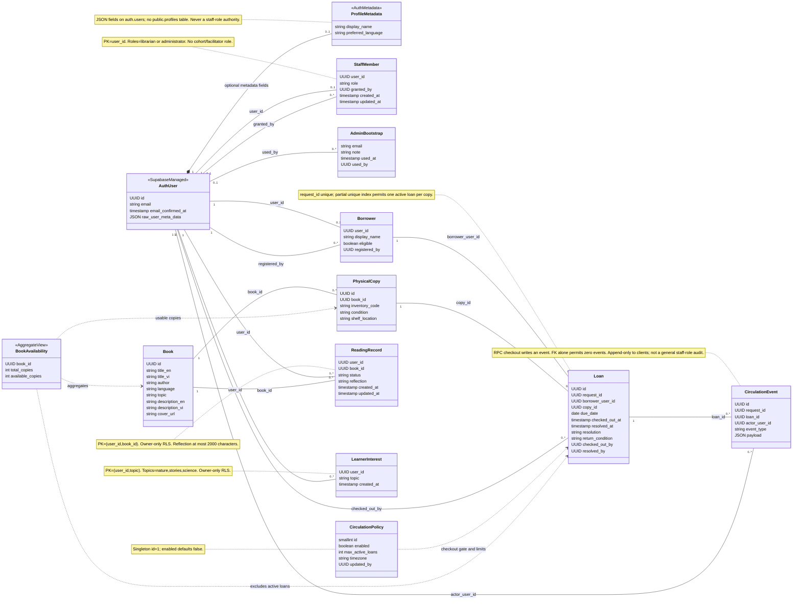
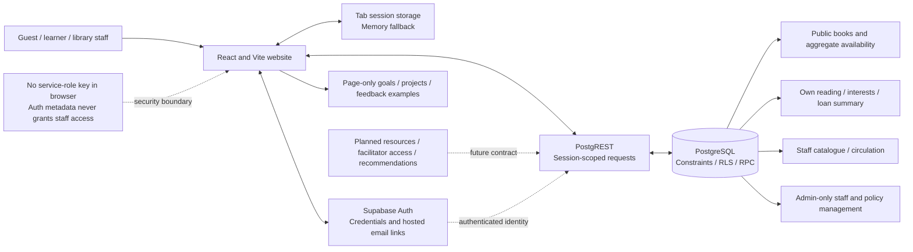
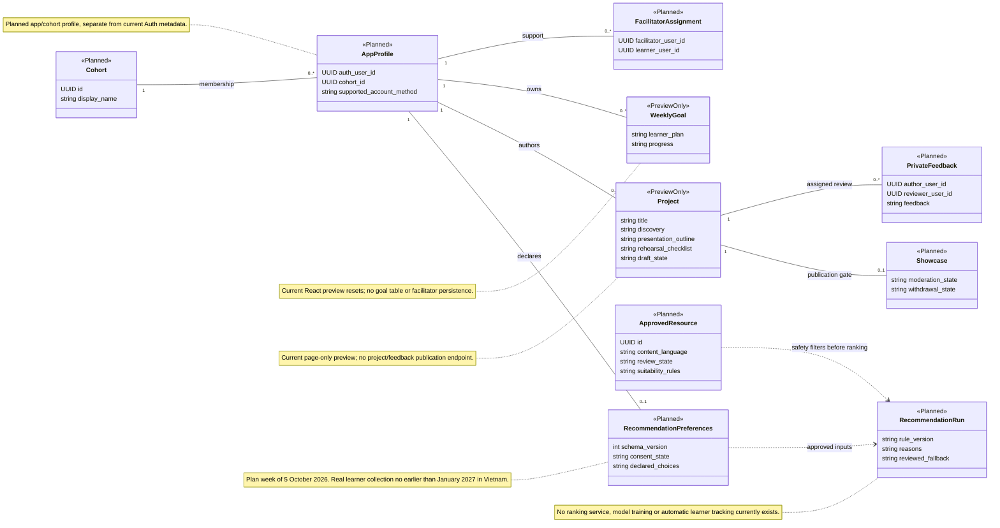

# HealEduTech implementation UML and backend audit

Date: 2 October 2026. Source: the current `codex/apple-design-preview` working checkout, including preserved September work and the new corrective migration. Requirements trace to [PLAN.md](../PLAN.md); frontend verification is recorded separately in [the current verification report](VERIFICATION_2026-10-02.md).

All **17 migrations**, **five existing SQL suites** and **five concurrent-client probes** passed in an isolated local PostgreSQL 18.4 cluster after the correction. Two concurrency defects were reproduced before the fix. No hosted Supabase migration, setting, seed or other write was performed. Hosted email, Auth sessions and PostgREST have not been certified by these tests. Lending remains subject to its EVG activation gates.

## Implemented and planned boundaries

| Area | Current implementation | Boundary / outstanding work |
|---|---|---|
| Auth and profile | Supabase-managed `auth.users`; registration adds `display_name` and `preferred_language` JSON metadata | No `public.profiles` table. User-editable metadata never grants staff rights. Account invitation, deletion/export policy and hosted recovery evidence remain open |
| Staff | `staff_members`, protected bootstrap allowlist, administrator RPCs | Only `librarian` and `administrator`. No cohort, facilitator or moderator role. Existing membership/grant metadata is not a complete role-change audit |
| Catalogue | Public bilingual books, author/language/topic/descriptions/cover; accent-insensitive literal search | One topic string from nature/stories/science. No normalized topic table, edition uniqueness constraint, approval state or book archive field |
| Physical stock | Distinct `book_copies`, unique inventory codes, condition and shelf location; loan-history-safe total adjustment | Raw inventory is staff-only. Routine shelf/condition editing and stock reconciliation through UI remain incomplete |
| Circulation | Policy, registered eligible borrowers, loans, partial active-loan unique index, append-only client audit events and authorised RPCs | Disabled by default. EVG eligibility, limits, due dates, timezone, loss/damage procedure and operational/paper rehearsal are required before activation |
| Reading | Composite `(user_id, book_id)` records with status/reflection and updated-at trigger | Owner-only, including against unrelated librarians. Reading is independent of loans; UI offers optional review after finishing and preserves it when reopened |
| Interests | Composite `(user_id, topic)` owner-only set; per-user serialised replacement RPC | Existing three-topic choices are not a complete recommendation preferences model; recommendations and automatic tracking do not exist |
| Availability | Public aggregate `book_availability` view | Counts usable copies without an active loan; exposes no borrower identity or raw shelf/condition records |
| Goals and presentations | React page-state goal and guided presentation/rehearsal previews | No goal, project or feedback tables. Refresh/navigation resets the previews; simulated feedback is not actual facilitator review |
| Social, resources and recommendations | Fictional examples, static editorial activities and training demonstrations | No award, showcase, moderation/comment, approved-resource or recommendation backend. Planned models below are explicitly future scope |

The ten application tables are `staff_members`, `books`, `book_copies`, `circulation_policy`, `circulation_borrowers`, `loans`, `circulation_events`, `reading_records`, `learner_interests` and `staff_admin_bootstrap`. Managed Auth tables and the aggregate view are separate. Class diagrams show selected important fields, not a complete physical schema export.

## Access and transaction contracts

Database grants and RLS are both required. UI guards help navigation but do not authorise a database request. Public RPC wrappers use the existing execution grants; private circulation/staff helpers perform Auth-backed membership checks under a fixed search path. `replace_my_interests` retains invoker security and owner RLS after its new advisory lock.

| Data / operation | Guest | Authenticated learner | Librarian | Administrator |
|---|---|---|---|---|
| Books, search, aggregate availability | Read | Read | Read; authorised create/edit/count/cover operations | Same catalogue operations |
| Raw physical inventory | Denied | Denied | Read; authorised inventory operations | Same |
| Staff membership table | Denied | Own row only, normally absent | Own row | Own row; full list/manage through checked staff RPCs |
| Initial administrator claim | Denied | Only exact configured confirmed allowlisted account before an administrator exists | Same bootstrap checks | Existing administrator management uses separate RPCs |
| Reading records and interests | Denied | Own reads/writes only | Own only; no access to another learner merely through librarian membership | Own only; no blanket private-learning access |
| Borrower and raw loan/event reads | Denied | Own records only under RLS | Authorised staff records | Same |
| `list_my_loans` projection | Denied | Own titles, inventory code, dates and resolution | Own projection | Own projection |
| Register borrower / eligibility / checkout / return / correction | Denied | Denied | Staff-authorised RPCs | Same |
| Enable policy / maximum loans / timezone | Denied | Denied | Denied | Administrator-authorised RPC |
| Staff role grant/revoke / protected full staff list | Denied | Denied | Denied | Administrator RPCs; last-admin invariant protected |
| Bootstrap allowlist direct client read/write | Denied | Denied | Denied | Denied; trusted database administration is separate |
| Goals / projects / feedback / cohort publication | No backend | No backend | No backend | No backend |

Raw own-loan SELECT remains permitted by RLS; the learner frontend uses the narrower `list_my_loans` projection. Public availability intentionally runs an aggregate over protected stock/loans and returns only book ID and counts. It must never gain borrower-identifying columns.

Important current sources, with lines at this audit baseline:

- Auth registration metadata: [SignInPage.tsx:92](../src/features/auth/SignInPage.tsx#L92). Stale Auth/staff response guards: [AccountProvider.tsx:66](../src/features/auth/AccountProvider.tsx#L66). Configured route guards and staff destinations: [App.tsx:52](../src/app/App.tsx#L52) and [RequireStaff.tsx:34](../src/features/auth/RequireStaff.tsx#L34).
- Public books and owner staff membership: [initial schema:2](../supabase/migrations/20260911082847_accounts_and_catalogue.sql#L2). Current inventory restriction and own-loan projection: [inventory migration:8](../supabase/migrations/20260923070401_restrict_copy_inventory.sql#L8).
- Loan consistency, client write restrictions, active-loan unique index and aggregate view: [circulation schema:41](../supabase/migrations/20260920123336_circulation.sql#L41), [index:74](../supabase/migrations/20260920123336_circulation.sql#L74), [events:78](../supabase/migrations/20260920123336_circulation.sql#L78), [view:101](../supabase/migrations/20260920123336_circulation.sql#L101). Checkout checks/locks: [checkout helper:230](../supabase/migrations/20260920123336_circulation.sql#L230).
- Reading/interests ownership and constraints: [reading migration:2](../supabase/migrations/20260920123406_reading_and_interests.sql#L2). Private staff management grants and last-admin protection: [staff migration:75](../supabase/migrations/20260920123529_staff_access_management.sql#L75).
- Copy-count adjustment preserves all copies with any loan history: [copy-count migration:34](../supabase/migrations/20260927090000_set_book_copy_count.sql#L34). The RPC accepts a total of 1–100; this is not a universal schema cap on every possible staff SQL insert.
- Final copy-before-loan resolution/correction locking and serialised interest replacement: [corrective migration:11](../supabase/migrations/20261002130000_serialize_interest_and_loan_corrections.sql#L11), [correction:72](../supabase/migrations/20261002130000_serialize_interest_and_loan_corrections.sql#L72), [interests:136](../supabase/migrations/20261002130000_serialize_interest_and_loan_corrections.sql#L136).

## Reproduced defects and local correction evidence

The original five suites passed against the sixteen-migration September baseline. Paired transactions with a controlled commit barrier then exposed the following. Baseline results/logs were preserved before changing the implementation.

| Priority / requirement | Before correction | Corrective change | Verified after correction |
|---|---|---|---|
| P1 / FR07, NFR09 | Checkout held a copy lock with an uncommitted new loan. Correction of an older returned loan checked for active loans before acquiring that lock. Both calls succeeded; final copy was lost while a new active loan existed | Resolution and correction use copy → loan lock order; correction rechecks active loans after the copy lock | Checkout succeeds. Correction waits, then rejects safely. Exactly one new active loan; copy stays usable; old loan stays returned |
| P2 / FR11, NFR09 | Two replacements of an initially empty interest set both succeeded, merging nature and stories although neither request submitted the union | Namespaced per-Auth-user transaction advisory lock before delete/insert; owner RLS and transactional rollback preserved | Both calls succeed in order; final set is exactly the later submitted stories set |
| P2 / FR23 | Metadata/copy RPC committed, then a separate cover RPC failed; the editor reported a generic failed save | Typed cover-only error and explicit partial-save status; refresh inventory, preserve cover draft and convert committed create to edit of the same ID | Local browser fixture: details/copies visible, cover failure announced; retry with changed title yields one create and one update, no duplicate book. The two RPCs remain non-atomic |

The first draft of the corrective migration applied but failed the circulation suite because a local `copy_id` variable conflicted with a column reference. That intermediate failure was preserved, then corrected with `target_copy_id` and a qualified active-loan query. Final evidence below is from a fresh replay after that correction, not the intermediate draft.

| Final local check | Result / practical evidence |
|---|---|
| Sorted migration replay | 17/17 apply successfully to a new database |
| `access.sql` | Pass: staff bootstrap, role management and protected invariants |
| `circulation.sql` | Pass: permission/gate, checkout, retry, resolution/correction, copy adjustment and inventory/own-loan boundaries |
| `reading.sql` | Pass: owner access, denied cross-user/staff access, statuses, reflection constraints and transactional interest validation |
| `search.sql` | Pass: accent-insensitive Vietnamese search and literal special characters |
| `seed.sql` | Pass: stable bilingual catalogue/seed expectations |
| Concurrent interest replacement | Pass: both clients succeed; final topics exactly `[stories]` |
| Concurrent same-copy checkout | Pass: one succeeds and one is rejected; one active loan |
| Concurrent borrower limit | Pass: one succeeds and one is rejected; one active loan at limit one |
| Concurrent same-request checkout | Pass: both identical retries succeed; one loan row |
| Old correction versus new checkout | Pass: checkout succeeds; unsafe correction rejected; expected exact final state |
| SQL-suite rollback state | 0 Auth users, loans, reading records and interests; 6 seeded books / 14 copies; lending disabled |
| Test cleanup | Four investigation cluster directories removed after verifying they were stopped; each reusable-runner cluster is stopped/removed automatically; logs, scripts and source hashes retained |

Five SQL suites are counted as suites, not as five individual assertions or complete exhaustive proof. Five paired-client probes cover the stated critical interleavings; they do not prove every possible transaction schedule. The retained SHA-256 map covers all 17 migration files and five suite files at the final replay. The repository runner also asserts that private suite fixtures rolled back and lending remains disabled before it creates concurrent synthetic fixtures. Current frontend evidence is 35 passing unit tests, 80 public and 32 staff layout checks, and 14 combined enlarged-text/spacing checks; these are separately scoped in [the frontend verification report](VERIFICATION_2026-10-02.md).

## Runtime, reproduction and limitations

PostgreSQL 18.4 was available locally through Homebrew. No Docker/Supabase CLI runtime was available. The isolated cluster used a private Unix socket, `listen_addresses=''`, and port 6543; it exposed no TCP listener. All data was synthetic. A minimal local shim provided `anon`/`authenticated` roles, `auth.users`, `auth.uid()` and session claim settings so real PostgreSQL constraints, grants, RLS, functions, locks and rollback could execute. Concurrency fixtures were committed only inside that disposable cluster and deleted with the cluster.

The shim does **not** implement Supabase GoTrue, PostgREST, signed JWT verification, refresh-token rotation, production service ownership/default privileges, actual confirmation/recovery delivery, provider allowlists, hosted extension/version differences, browser storage or network failures. Trusted local superuser setup is not an attacker test. Direct real API requests and real hosted accounts/email are still required before production claims. No existing hosted credentials or learner records were used.

Retained evidence is outside the application checkout in [the backend output folder](../../outputs/backend-audit-2026-10-02/): [final replay](../../outputs/backend-audit-2026-10-02/results.json), [concurrency results](../../outputs/backend-audit-2026-10-02/concurrency-results.json), [cleanup](../../outputs/backend-audit-2026-10-02/cleanup.json), [final repository runner evidence](../../outputs/backend-audit-2026-10-02/final-run/results.json), `before-fix/`, and `intermediate-ambiguous-copy-id/`. The retained one-off scripts document the initial investigation. For future maintainers, use the repository [local regression runner](../supabase/tests/run-local.py): it locates this checkout relative to its own file, clears inherited PostgreSQL connection/service variables and accepts no database URL or existing database. It requires Python 3.10+, local `initdb`/`pg_ctl`/`psql` and a POSIX host. A new private-socket cluster is created, all migrations/suites and five paired-client probes run, and the stopped cluster is removed automatically. JSON/logs are retained in a new temporary evidence folder or the explicitly requested new/empty output folder. Expected rejection SQLSTATEs are checked so a timeout does not count as a successful conflict test.

```sh
python3 supabase/tests/run-local.py
# Optional: retain evidence in a new or empty chosen folder.
python3 supabase/tests/run-local.py --output /tmp/healedutech-sql-check
```

## Remaining production work

| Priority / requirements | Concrete remaining work | Evidence needed |
|---|---|---|
| P1 / FR01–02, FR10–11, FR23, NFR08 | Rehearse real hosted confirmation, recovery, sign-out and private data boundaries after reviewing the exact target project and migration state | Real email receipt/expiry; direct denied API calls; account switching and refresh; no learner-data collection before agreed rollout gates |
| P1 / FR06–09, FR21, BR09–10 | Keep lending disabled until EVG approves rules and operators rehearse reconciled inventory and paper fallback | Actual shelf/copy audit, policy ownership, due-date/loss procedure and operator walkthrough |
| Release check / FR23 | Catalogue metadata/count and cover RPCs remain separate transactions, with explicit recovery now implemented ([catalogue.ts:95–126](../src/features/library/catalogue.ts#L95), [BookManagement.tsx:80–87](../src/features/admin/BookManagement.tsx#L80)) | Local recovery passed as recorded above; repeat injected cover/refresh failures against the actual hosted deployment before release |
| P2 / FR05/07/21 | Correction RPC has no frontend binding in [circulation data:116](../src/features/circulation/data.ts#L116). Eligibility setter exists but is not used by the desk; borrower registration asks for a UUID ([desk:133](../src/features/circulation/CirculationPage.tsx#L133)) | Nontechnical correction/eligibility/account-lookup workflow and reviewed audit outcomes |
| P2 / FR02/12–17 | Implement future cohort/facilitator privacy, resumable goals, project/private feedback and reviewed resource publishing as separate increments | Migrations and assigned-owner tests; no peer leakage; EVG content/moderation owner; previews do not count as saved records |
| P2 / FR21–22, NFR10/12/14 | Agree retention, account removal/export, staff-role audit needs, funded backup/restore and handover owners | Tested authorised export/deletion, restore of files plus data/permissions, named successor and actual handover |
| P2 / NFR06/15–17 | Measure typography/font and motion cost on agreed learner devices/network; review Vietnamese terminology with EVG | Current automated/browser layout evidence is useful but is not representative learner usability or pilot-device performance |

Recommendation planning starts the week of **5 October 2026** with an editable preferences/data contract and synthetic cold-start baseline. Real learner rollout and new preference collection start no earlier than **January 2027 in Vietnam**, after survey findings, consent/retention/access decisions and release gates. Existing private three-topic interests may be reused in the design. No present evidence justifies model training, automatic behavioural tracking or a recommendation/AI claim.

## UML source set

The implemented diagrams below use current names and operations. The future learning diagram is intentionally separate. The standalone [rendered class diagram](uml/rendered.html) accompanies the editable source. Editable Mermaid sources are [implemented classes](uml/implemented-domain.mmd), [Auth sequence](uml/auth-sequence.mmd), [catalogue/reading sequence](uml/catalogue-reading-sequence.mmd), [circulation sequence](uml/circulation-sequence.mmd), [deployment/access map](uml/deployment-access.mmd) and [planned learning classes](uml/planned-learning-domain.mmd). The deployment map is a component/data-flow diagram, not a strict UML deployment notation.

### Implemented class diagram

FR01–02, FR04–11, FR21. Auth metadata is logical, not a separate profile table. Foreign-key cardinalities describe the schema; the circulation RPC imposes additional behaviour.



### Implemented Auth sequence

FR01–02, FR23, NFR08. Hosted Auth/email behaviour is a release contract, not a result of the SQL shim tests.

```mermaid
sequenceDiagram
    actor Person as Learner or staff
    participant UI as SignInPage
    participant Client as Supabase JS and tab session storage
    participant Auth as Supabase Auth
    participant Email as Hosted email delivery
    participant Provider as AccountProvider
    participant API as PostgREST
    participant DB as PostgreSQL RLS
    alt Registration
        Person->>UI: Display name, email, password, confirmation
        UI->>UI: Validate input and safe return URL
        UI->>Auth: signUp plus display_name and preferred_language metadata
        Auth->>Email: Confirmation link if confirmation required
        UI-->>Person: Pending confirmation; clear password fields
        Person->>Auth: Follow valid hosted link
        Auth-->>Client: Callback session on allowlisted sign-in URL
    else Password sign-in
        Person->>UI: Email and password
        UI->>Auth: signInWithPassword
        Auth-->>Client: Session or safe authentication error
    else Recovery
        UI->>Auth: resetPasswordForEmail with safe callback URL
        Auth->>Email: Recovery link
        Person->>Auth: Follow recovery link
        Auth-->>Provider: PASSWORD_RECOVERY event
        UI->>Auth: updateUser with new password
        UI->>Auth: Local sign-out
        UI-->>Person: Sign in again or explicit sign-out failure
    end
    Client->>Client: Store session per tab; memory fallback if storage unavailable
    Client-->>Provider: Auth state change
    Provider->>API: Select own staff_members row using session
    API->>DB: Apply authenticated role, auth.uid and RLS
    DB-->>Provider: Own librarian/admin membership or no staff membership
    Provider-->>UI: Learner access or permitted staff controls
    Note over Provider,DB: User-editable metadata never grants a staff role
    Note over Auth,Email: Real hosted receipt, expiry and recovery remain separate release tests
```

### Implemented catalogue and private reading sequence

FR04, FR08, FR10–11. Normal browsing is public; private mutations use the authenticated owner. Saved reflection survives reading-status changes.

```mermaid
sequenceDiagram
    actor Visitor as Guest or learner
    participant UI as Library and My reading
    participant Client as Supabase JS
    participant API as PostgREST
    participant DB as PostgreSQL
    Visitor->>UI: Browse, search or filter topic
    UI->>Client: listBooks with bounded page and abort signal
    alt Nonempty query
        Client->>API: search_books with literal query
        API->>DB: Invoker search; unaccent and Vietnamese d normalization
    else Browse
        Client->>API: Select public books
        API->>DB: Public catalogue SELECT policy
    end
    DB-->>UI: Book metadata page
    Client->>API: Select book_availability for visible book IDs
    API->>DB: Read aggregate availability view
    DB-->>UI: Total and available counts without borrower identities
    Note over Client,UI: Availability error yields unknown availability, never an invented count
    alt Authenticated learner saves reading
        Visitor->>UI: Mark reading/finished; optional finished-book review
        UI->>Client: saveReading with preserved reflection
        Client->>API: UPSERT reading_records on user_id,book_id
        API->>DB: Owner RLS and status/reflection constraints
        DB->>DB: Update updated_at trigger
        DB-->>UI: Saved row or failure; retain draft on failure
    else Guest
        UI-->>Visitor: Sign-in path; no private write
    end
    Visitor->>UI: Replace own interest choices
    Client->>API: replace_my_interests
    API->>DB: Own-user transaction and topic constraints
    DB-->>UI: Complete saved selection or error
    Note over API,DB: Concurrent whole-set replacement must serialize per user
```

### Implemented circulation sequence, activation gated

FR06–09, BR01–06, NFR09. Copy-before-loan locking reflects the locally verified corrective migration; hosted application of that migration is a separate gate.

```mermaid
sequenceDiagram
    actor Operator as Library operator
    participant UI as CirculationDesk
    participant API as Public RPC and private helper
    participant DB as PostgreSQL transaction
    Operator->>UI: Select eligible borrower, usable copy, due date
    UI->>API: checkout_circulation_copy with retry-stable request_id
    API->>DB: Verify Auth-backed librarian/admin membership
    API->>DB: Acquire request advisory lock
    alt Matching request already exists
        DB-->>UI: Return existing loan
    else Conflicting request payload
        DB-->>UI: Reject without another loan
    else New request
        API->>DB: Lock policy row; check enabled gate
        alt Lending disabled
            DB-->>UI: Reject checkout
        else Lending enabled
            API->>DB: Lock eligible borrower and physical copy
            API->>DB: Validate local due date, copy condition, borrower limit
            API->>DB: Insert loan and circulation event atomically
            DB->>DB: Enforce one active loan per physical copy
            DB-->>UI: Saved loan or conflict
        end
    end
    Operator->>UI: Record usable/damaged return or loss
    UI->>API: resolve_circulation_loan with retry-stable request_id
    API->>DB: Verify staff and validate matching retry
    API->>DB: Lock and revalidate physical copy and loan
    API->>DB: Set resolution, update condition, append event
    DB-->>UI: Saved resolution; refresh aggregate availability
    Note over API,DB: Old-resolution correction must lock the copy before rechecking later active loans
    Note over UI,DB: Checkout and return do not change reading status or award recognition
    Note over UI,DB: Lending activation still requires EVG policy and operational rehearsal
```

### Implemented component and access map

FR02, FR18, NFR08. Fictional page-state examples and planned services are separate from authorised database operations.



### Planned learning classes, not current schema

FR12–17, FR19–20. No migration currently creates these classes. Assigned feedback/cohort access needs an explicit future privacy design; real preference collection cannot start before the agreed January 2027 rollout.


